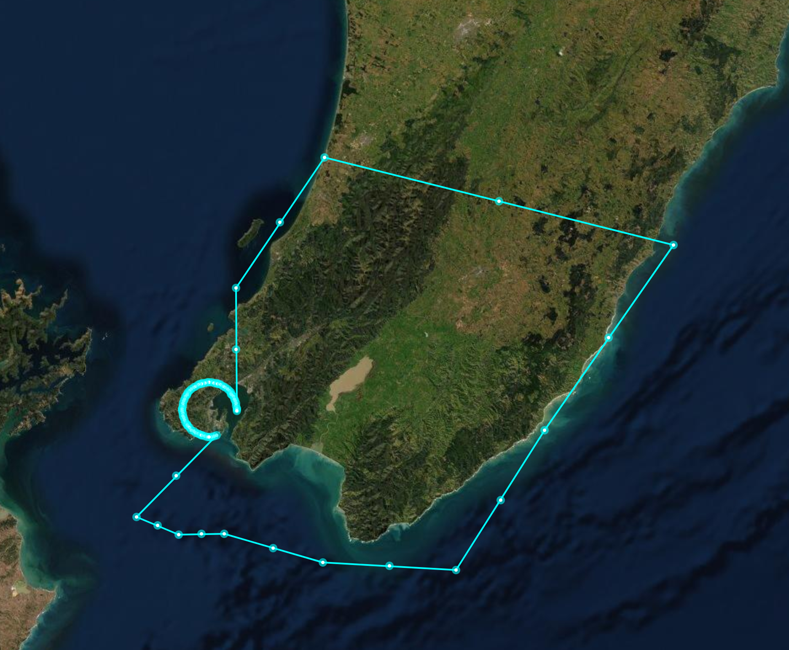
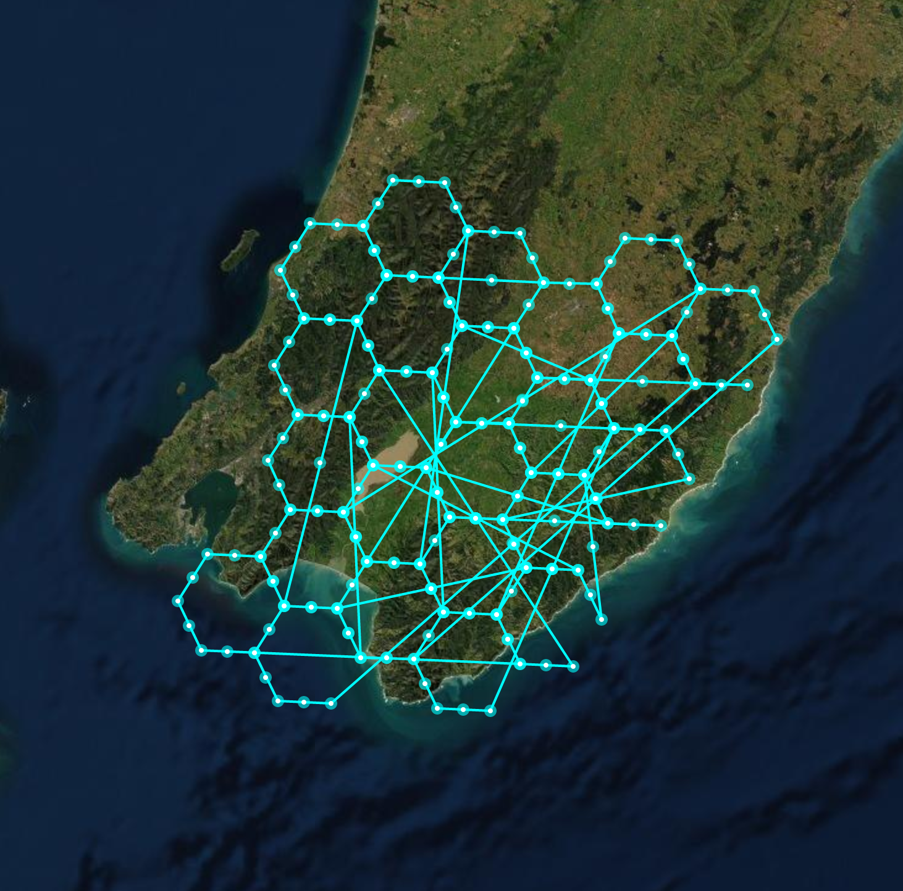
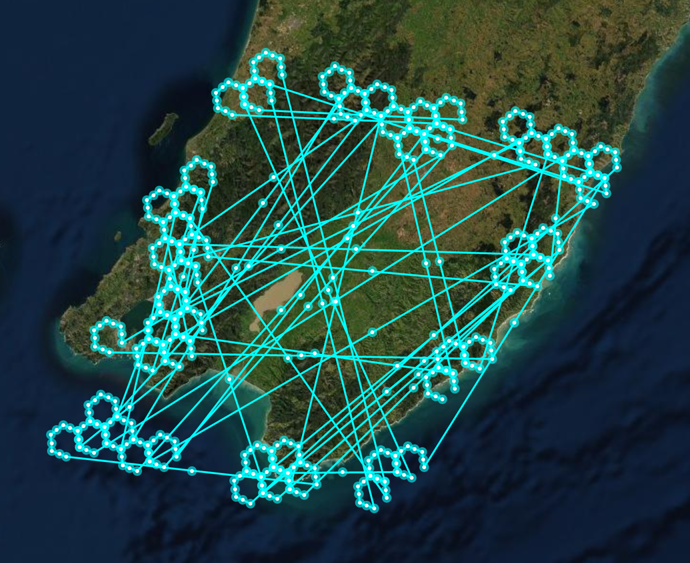
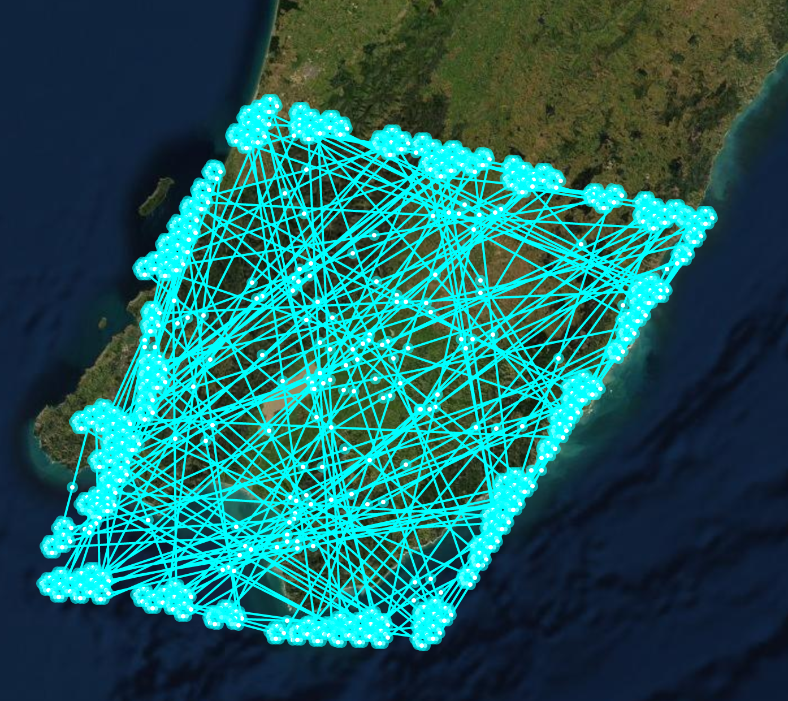

# Goal

## Exo

un service GRPC (tonic rust)

qui power des polygons

que tu puisse query avec des lat/lng

ou h3 id, que tu puisse insert des polygons

https://github.com/uber/h3
https://eng.uber.com/h3/

## Bonus

Une API graphql (https://github.com/async-graphql/async-graphql)

## Status

- [x] indexing system (h3)
- [x] query system
- [x] insert system
- [x] grpc api
- [ ] graphql

## Infos

You can modify resolution layer in the ResolutionDetails enum

./test-grpc.sh contain example call

./bench.sh contain a benchmark tool but please populate with ./test-grpc.sh first

## example :

This is the best reprentation I could make but this does not really reflect the polygon stored has there's a lot of line between each

Zone to cover :



first level of resolution :



second level of resolution without what is already covered:



last level of resolution without what is already covered:



This way the map is covered

## benchmark :

here's a be benchmark result on 100 connection for 200000 requests

```
Summary:
Count: 200000
Total: 4.86 s
Slowest: 14.29 ms
Fastest: 0.15 ms
Average: 2.35 ms
Requests/sec: 41158.89

Response time histogram:
0.148 [1] |
1.562 [8943] |∎∎
2.975 [167549] |∎∎∎∎∎∎∎∎∎∎∎∎∎∎∎∎∎∎∎∎∎∎∎∎∎∎∎∎∎∎∎∎∎∎∎∎∎∎∎∎
4.389 [20440] |∎∎∎∎∎
5.803 [2221] |∎
7.217 [477] |
8.631 [110] |
10.044 [87] |
11.458 [99] |
12.872 [36] |
14.286 [37] |

Latency distribution:
10 % in 1.70 ms
25 % in 1.94 ms
50 % in 2.25 ms
75 % in 2.55 ms
90 % in 3.09 ms
95 % in 3.53 ms
99 % in 4.89 ms

Status code distribution:
[OK] 200000 responses
```

some optimization could be done to reach sub-ms latency
